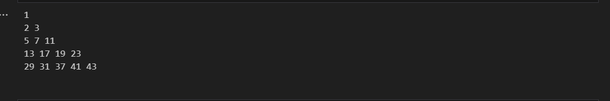
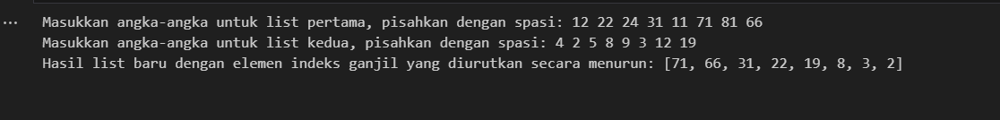
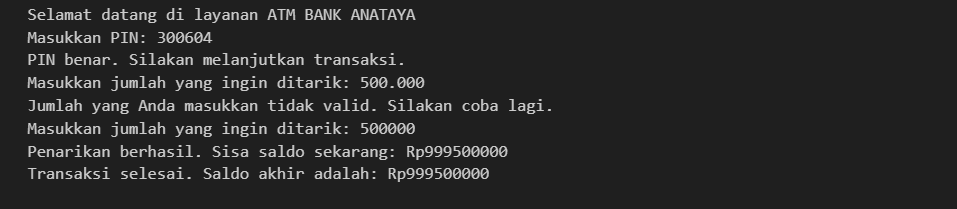
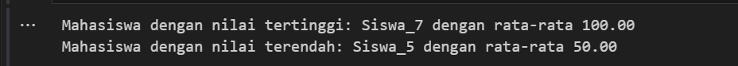
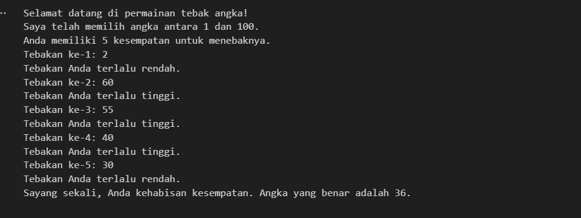
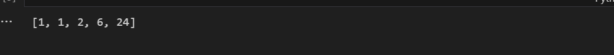
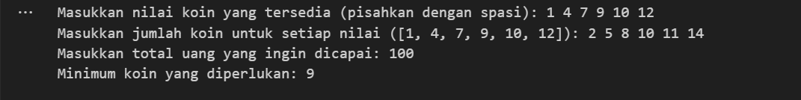
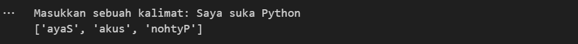
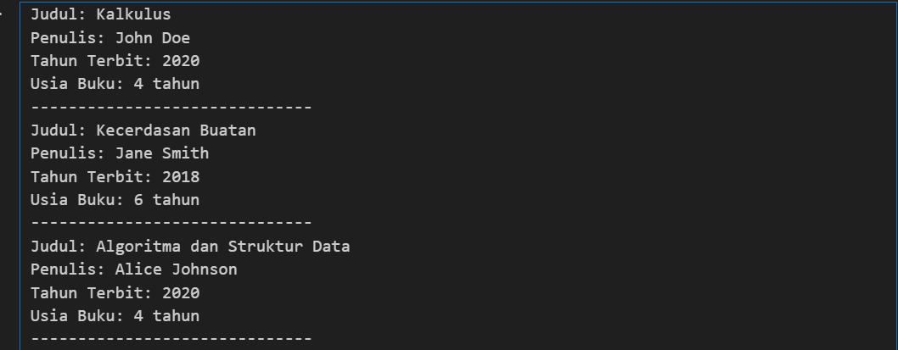
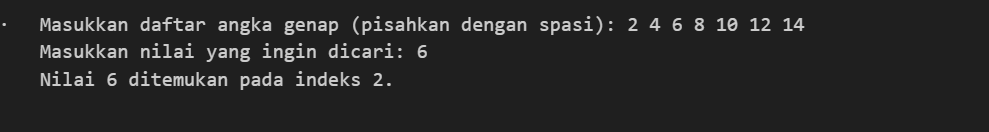

# <h1 align="center">Laporan Praktikum Modul Dasar Dasar Python untuk Sains Data</h1>
<p align="center">Syalaisha Nisrina Anataya</p>

## Dasar Teori

## Guided
```C++

```

## Unguided
### 1. Buatlah program yang dapat menghasilkan pola berbentuk angka seperti di bawah ini, dengan syarat angka yang ditampilkan adalah hasil dari penjumlahan bilangan prima sebelumnya:
### ```
### 1
### 2 3
### 5 7 11
### 13 17 19 23
### ...
### ```
### Jumlah angka pada setiap baris bertambah 1, dan bilangan yang ditampilkan adalah bilangan prima.
```C++
def is_prime(num):
    if num <= 1:
        return False
    for i in range(2, int(num ** 0.5) + 1):
        if num % i == 0:
            return False
    return True

def generate_pattern(rows):
    prime_list = []
    num = 2  # Mulai dengan angka prima pertama
    
    # Cetak angka pertama sebagai 1
    print(1)
    
    for i in range(2, rows + 1):  # Mulai dari baris kedua
        count = 0  # Menghitung jumlah elemen dalam baris
        while count < i:
            if is_prime(num):
                prime_list.append(num)
                print(num, end=' ')
                count += 1
            num += 1
        print()  # Pindah ke baris berikutnya

# Menentukan jumlah baris
rows = 5
generate_pattern(rows)
```
### Output :

### 2. Buatlah sebuah fungsi yang menerima dua input berupa list angka. Fungsi ini harus mengembalikan sebuah list baru yang berisi elemen dari dua list input yang memiliki indeks ganjil. List baru tersebut juga harus diurutkan secara menurun berdasarkan nilai elemen.
```C++
def ambil_ganjil_dan_urutkan(list1, list2):
    # Ambil elemen dengan indeks ganjil dari kedua list
    ganjil_list1 = [list1[i] for i in range(1, len(list1), 2)]
    ganjil_list2 = [list2[i] for i in range(1, len(list2), 2)]
    
    # Gabungkan elemen dari kedua list
    hasil = ganjil_list1 + ganjil_list2
    
    # Urutkan secara menurun
    hasil.sort(reverse=True)
    
    return hasil

# Menerima input dari pengguna
list1 = list(map(int, input("Masukkan angka-angka untuk list pertama, pisahkan dengan spasi: ").split()))
list2 = list(map(int, input("Masukkan angka-angka untuk list kedua, pisahkan dengan spasi: ").split()))

# Memanggil fungsi dan menampilkan hasil
result = ambil_ganjil_dan_urutkan(list1, list2)
print("Hasil list baru dengan elemen indeks ganjil yang diurutkan secara menurun:",  result)
```
### Output :

### 3. Buat sebuah program untuk mensimulasikan transaksi ATM. Program harus:
### a. Meminta pengguna memasukkan PIN (dibatasi 3 kali percobaan).
### b. Setelah PIN benar, meminta jumlah penarikan.
### c. Jika saldo kurang dari jumlah yang ditarik, munculkan pesan kesalahan.
### d. Jika penarikan berhasil, tampilkan saldo akhir.
```C++
PIN_ATM = "300604"
saldo = 1000000000

def verifikasi_pin():
    percobaan = 0
    while percobaan < 3:
        pin_input = input("Masukkan PIN: ")
        if pin_input == PIN_ATM:
            return True
        else:
            percobaan += 1
            print(f"PIN salah. Anda memiliki {3 - percobaan} percobaan lagi.")
    return False

def penarikan_saldo(saldo):
    while True:
        try:
            jumlah_tarik = int(input("Masukkan jumlah yang ingin ditarik: "))
            if jumlah_tarik > saldo:
                print("Saldo tidak mencukupi. Transaksi tidak bisa diproses.")
            else:
                saldo -= jumlah_tarik
                print(f"Penarikan berhasil. Sisa saldo sekarang: Rp{saldo}")
                break
        except ValueError:
            print("Jumlah yang Anda masukkan tidak valid. Silakan coba lagi.")
    return saldo

def atm_program():
    print("Selamat datang di layanan ATM BANK ANATAYA")
    if verifikasi_pin():
        print("PIN benar. Silakan melanjutkan transaksi.")
        saldo_akhir = penarikan_saldo(saldo)
        print(f"Transaksi selesai. Saldo akhir adalah: Rp{saldo_akhir}")
    else:
        print("Anda telah salah memasukkan PIN 3 kali. Akses ditolak.")

atm_program()
```
### Output :

### 4. Anda diberikan file CSV berisi data nilai ujian mahasiswa. Tugas Anda adalah menulis sebuah program yang:
1. Membaca file CSV dan menyimpan datanya ke dalam dictionary.
2. Menghitung rata-rata nilai tiap mahasiswa.
3. Menampilkan mahasiswa dengan nilai tertinggi dan terendah.
```python
import csv

def baca_file_csv(nama_file):
    data_mahasiswa = {}
    with open(nama_file, mode='r') as file:
        csv_reader = csv.reader(file)
        header = next(csv_reader)
        for row in csv_reader:
            nama = row[0]
            nilai = list(map(float, row[1:]))
            data_mahasiswa[nama] = nilai
    return data_mahasiswa

def hitung_rata_rata(data_mahasiswa):
    rata_rata = {}
    for nama, nilais in data_mahasiswa.items():
        rata_rata[nama] = sum(nilais) / len(nilais)
    return rata_rata

def tampilkan_nilai_ekstrem(rata_rata):
    mahasiswa_tertinggi = max(rata_rata, key=rata_rata.get)
    mahasiswa_terendah = min(rata_rata, key=rata_rata.get)

    print(f'Mahasiswa dengan nilai tertinggi: {mahasiswa_tertinggi} dengan rata-rata {rata_rata[mahasiswa_tertinggi]:.2f}')
    print(f'Mahasiswa dengan nilai terendah: {mahasiswa_terendah} dengan rata-rata {rata_rata[mahasiswa_terendah]:.2f}')

def main():
    nama_file = 'siswa_nilai (1).csv'
    data_mahasiswa = baca_file_csv(nama_file)
    rata_rata = hitung_rata_rata(data_mahasiswa)
    tampilkan_nilai_ekstrem(rata_rata)

if __name__ == "__main__":
  main()
```
### Output :


### 5. Buatlah permainan sederhana menggunakan Python, di mana komputer akan memilih sebuah angka secara acak antara 1 hingga 100, dan pengguna harus menebak angka tersebut. Setiap tebakan yang salah akan memberikan petunjuk apakah angka yang ditebak lebih besar atau lebih kecil dari angka sebenarnya. Batasi jumlah percobaan menjadi 5 kali. Setelah permainan selesai, tampilkan apakah pemain menang atau kalah.
```python
import random

def tebak_angka():
    angka_rahasia = random.randint(1, 100)
    percobaan = 5

    print("Selamat datang di permainan tebak angka!")
    print("Saya telah memilih angka antara 1 dan 100.")
    print(f"Anda memiliki {percobaan} kesempatan untuk menebaknya.")

    for i in range(percobaan):
        tebakan = int(input(f"Tebakan ke-{i + 1}: "))

        if tebakan < angka_rahasia:
            print("Tebakan Anda terlalu rendah.")
        elif tebakan > angka_rahasia:
            print("Tebakan Anda terlalu tinggi.")
        else:
            print("Selamat! Anda berhasil menebak angka yang tepat!")
            break
    else:
        print(f"Sayang sekali, Anda kehabisan kesempatan. Angka yang benar adalah {angka_rahasia}.")

if __name__ == "__main__":
    tebak_angka()
```
### Output :

Kode program tersebut adalah permainan sederhana menebak angka dengan python dengan angka acak 1 - 100 dang pengguna hanya memiliki kesempatan  sebanyak 5 kali menebak. Kode program menggunakan import random untuk menghasilkan angka acak. Pada permainan pengguna diminta menginputkan angka yang kemudian akan di periksa kebenarannya oleh sistem.
### 6. Buat fungsi rekursif yang menerima input bilangan bulat `n` dan menghasilkan urutan bilangan seperti berikut ini:
```
Input: n = 4
Output: 1, 1, 2, 6, 24
```
### Fungsi ini harus menggunakan konsep rekursi untuk menghitung faktorial setiap angka hingga `n`.
```python
# Fungsi rekursif untuk menghitung faktorial
def faktorial(n):

    if n == 0 or n == 1:
        return 1
    else:
        return n * faktorial(n - 1)

# Fungsi untuk menghasilkan urutan faktorial dari 1 hingga n
def urutan_faktorial(n):
    hasil = []
    for i in range(n + 1):
        hasil.append(faktorial(i))
    return hasil

n = 4
output = urutan_faktorial(n)
print(output)
```
### Output :

Kode program tersebut menghitung faktorial dengan n=4 yang menerapkan fungsi rekursif. 
### 7. Buatlah program untuk memecahkan masalah "minimum coin change". Diberikan jumlah uang dan daftar nilai koin yang tersedia (misalnya, 1, 5, 10, 25), tentukan kombinasi minimum koin yang diperlukan untuk mencapai jumlah uang tersebut. Namun, program Anda harus bisa menangani koin-koin yang nilai dan jumlahnya ditentukan pengguna.
```python
def min_coin_change_greedy(coins, amounts, total):
    sorted_coins = sorted(zip(coins, amounts), key=lambda x: -x[0])
    
    total_coins = 0
    for coin, amount in sorted_coins:
        if total == 0:
            break
        max_use = min(total // coin, amount)
        total -= max_use * coin
        total_coins += max_use

    if total == 0:
        return total_coins
    else:
        return float('inf')

def get_input():
    coins = list(map(int, input("Masukkan nilai koin yang tersedia (pisahkan dengan spasi): ").split()))
    amounts = list(map(int, input(f"Masukkan jumlah koin untuk setiap nilai ({coins}): ").split()))
    total = int(input("Masukkan total uang yang ingin dicapai: "))
    return coins, amounts, total

def display_result(result):
    if result == float('inf'):
        print("Tidak mungkin mencapai jumlah tersebut dengan koin yang tersedia.")
    else:
        print(f"Minimum koin yang diperlukan: {result}")

def solve_min_coin_change():
    coins, amounts, total = get_input()
    result = min_coin_change_greedy(coins, amounts, total)
    display_result(result)

solve_min_coin_change()
```
### Output :

Kode program untuk memecahkan masalah "minimum coin change" menggunakan pendekatan greedy dengan memilih koin terbesar terlebih dahulu dan menggunakan sebanyak mungkin dari koin tersebut. Kode program mengammbil nilai koin dan total koin yang ingin dicapai dengan inputan user.
### 8. Buat sebuah program yang menerima string dari pengguna dan mengonversi string tersebut menjadi sebuah list berisi kata-kata terbalik. Misalnya:
```
Input: "Saya suka Python"
Output: ["ayaS", "akus", "nohtyP"]
```
```python
def balik_kata(kalimat):
    kata_kata = kalimat.split()
    kata_kata_terbalik = [kata[::-1] for kata in kata_kata]
    return kata_kata_terbalik

kalimat = input("Masukkan sebuah kalimat: ")
hasil = balik_kata(kalimat)
print(hasil)
```
### Output :

Kode program tersebut menerima inputan berupa string dari pengguna dan mengubahnya menjadi string dengan kata kata yang terbalik. Kode tersebut meggunakan `split()` untuk memisahkan string. Kemudian untuk membalik string digunakan slicing `[::-1]`
### 9. Buat class bernama `Buku` yang memiliki atribut `judul`, `penulis`, dan `tahun_terbit`. Buat method dalam class untuk menampilkan informasi buku, serta method untuk menghitung usia buku berdasarkan tahun saat ini. Buatlah 3 objek dari class `Buku` dan tampilkan informasi serta usia masing-masing buku.
```python
from datetime import datetime

class Buku:
    def __init__(self, judul, penulis, tahun_terbit):
        self.judul = judul
        self.penulis = penulis
        self.tahun_terbit = tahun_terbit

    # Menampilkan informasi buku
    def tampilkan_informasi(self):
        print(f"Judul: {self.judul}")
        print(f"Penulis: {self.penulis}")
        print(f"Tahun Terbit: {self.tahun_terbit}")

    # Menghitung usia buku
    def hitung_usia(self):
        tahun_sekarang = datetime.now().year
        usia_buku = tahun_sekarang - self.tahun_terbit
        return usia_buku

# Membuat 3 objek dari class Buku
buku1 = Buku("Kalkulus", "John Doe", 2020)
buku2 = Buku("Kecerdasan Buatan", "Jane Smith", 2018)
buku3 = Buku("Algoritma dan Struktur Data", "Alice Johnson", 2020)

# Menampilkan informasi dan usia masing-masing buku
for buku in [buku1, buku2, buku3]:
    buku.tampilkan_informasi()
    print(f"Usia Buku: {buku.hitung_usia()} tahun")
    print("-" * 30)
```
### Output :

Kode program tersebut membuat class `Buku` dengan atribut judul, penulis, dan tahun_terbit diinisialisasi melalui constructor __init__(). Kode program menerapkan konsep OOP, class,method, dan maniplasi atribut.

### 10. Buatlah program yang mengimplementasikan algoritma pencarian biner, namun dengan modifikasi: algoritma harus bisa mencari nilai di list yang hanya berisi angka genap, dan jika nilai yang dicari adalah angka ganjil, program harus menampilkan pesan bahwa nilai tersebut tidak bisa ditemukan.
```python
# Fungsi untuk pencarian biner
def pencarian_biner_genap(arr, target):
    # Cek apakah target adalah angka ganjil
    if target % 2 != 0:
        return f"Nilai {target} adalah angka ganjil dan tidak bisa ditemukan."

    # Inisialisasi batas awal dan akhir
    awal = 0
    akhir = len(arr) - 1

    while awal <= akhir:
        tengah = (awal + akhir) // 2

        # Cek apakah elemen tengah adalah target
        if arr[tengah] == target:
            return f"Nilai {target} ditemukan pada indeks {tengah}."
        # Jika target lebih kecil, cari di sebelah kiri
        elif arr[tengah] > target:
            akhir = tengah - 1
        # Jika target lebih besar, cari di sebelah kanan
        else:
            awal = tengah + 1

    return f"Nilai {target} tidak ditemukan."

arr = list(map(int, input("Masukkan daftar angka genap (pisahkan dengan spasi): ").split()))
arr.sort()  # List harus terurut untuk pencarian biner
target = int(input("Masukkan nilai yang ingin dicari: "))

hasil = pencarian_biner_genap(arr, target)
print(hasil)
```
### Output :

Kode program tersebut digunakan untuk menampilkan indeks lokasi dari angka yang dicari. List angka yang ada merupakan inputan dari user  berupa bilangan genap. 
## Kesimpulan

## Referensi